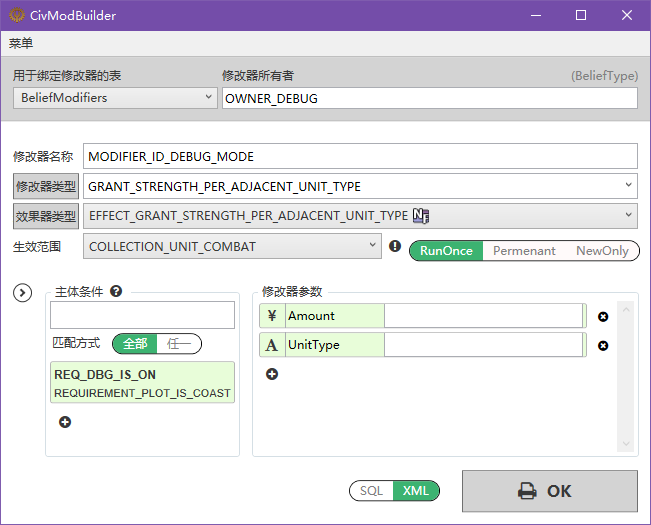

CivModBuilder 是新开发的一个小工具，可以查看《文明6》游戏中的各种 ModifierType、EffectType、RequirementType 等等，还能创建 sql 或者 xml 格式的 Modifier。

<!--more-->

#### 这个软件和“文明6 mod辅助工具”有什么区别？

“文明6 mod辅助工具”比较老，只收录了原版和《迭起兴衰》，没有《风云变幻》以及往后的 Modifier 数据。但是功能比较全面，可以处理图标、art.xml、本地文本等。

而新发布的 ModBuilder 目前只有查询、创建 Modifier 的功能。不过数据是最新的，包含了所有能在游戏中找到的全部 Modifier 相关数据。而且文件体积更小。

### [v1.1]

2023-12-16

https://pan.baidu.com/s/1XtnAUUSir4_3H9fOuEzgBA?pwd=897f

1. 数据更全面，完整覆盖所有 DLC。
2. 修复：ModifierType 输入框自动补全会影响到效果器。
3. 修复：自定义 ModifierType 的输出 sql 文件在 DynamicModifiers 后面缺少分号。
4. 修复：条件集的名称无法修改的 bug。

### [v1.0]

2023-08-14

1. 预览版，相当于《文明6 MOD辅助工具》中创建 Modifier 的功能。
