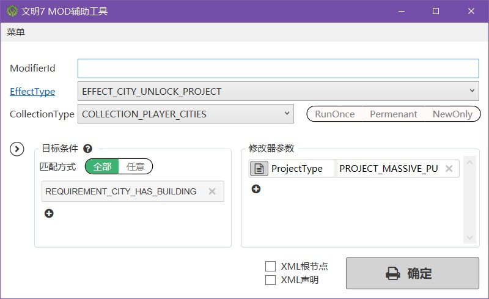

本工具用于《文明7》的 MOD 制作，方便玩家查看游戏内的各种 EffectType、CollectionType 以及 RequimentType 等。

<!--more-->

项目仓库： https://gitee.com/Hemmelfort/civmodbuilder7

该工具面向已经会手动制作 Modifier 的玩家，如果是新手可以先看我相关的[视频教程](https://space.bilibili.com/28399130)。

左上角**菜单**可以方便访问游戏相关的文件路径，如缓存目录、MOD 目录、日志文件等。

文明 7 简化了 Modifier 的写法，条件集 RequirementSetId 和子条件 RequirementId 都会自动生成，只有工具第一行的 ModifierId 属于**必填项**，它是该 Modifier 的标识符。

右下角的参数可以自行增删，有时候不是每个参数都用到。

### v1.1

2025-02-23

链接： https://pan.baidu.com/s/1ImoAfI0bgR-5Xg4w-2SFAg?pwd=zk3b 
提取码：zk3b

- fix: 多开时导致闪退
- fix: AvalonEdit 编辑器文档开头带BOM导致全文复制时可能有非法字符

### v1.0

2025-02-22

第一个正式版本。

